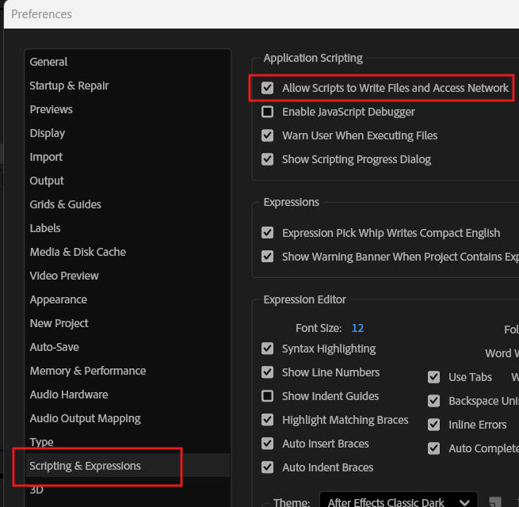

# RotoBridge

Moves roto splines between After Effects and Nuke.

Roto work tends to get redone because the two applications have no common
format for it. RotoBridge exports masks from one side and imports them on the
other through a small JSON interchange format called `.rbj`, keeping the
shapes, their animation, feather, opacity, and blend modes intact - and when
something genuinely cannot cross, it says so in a warning instead of dropping
it silently.

## How it works

An `.rbj` file carries two layers of the same animation: a dense per-frame
bake of every shape (the ground truth), and the sparse authored keyframes with
their interpolation. An importer uses the keys where the destination can
honour them and falls back on the bake where it cannot, adding corrective
keyframes until the result stays within a pixel tolerance you choose. The
format itself is documented in `spec/`.

## Install

You only need the half you use. Both on one machine is fine.

### After Effects

**1. Turn on the scripting preference.** It is off in a fresh install and
nothing works without it.

`Edit > Preferences > Scripting & Expressions > Allow Scripts to Write Files
and Access Network`

Restart After Effects afterwards. RotoBridge checks for this when the panel
opens and tells you if it is off, but doing it first saves a round trip.

**2. Keep the six `ae/*.jsx` files together** in a folder anywhere you like.
They include each other.

**3. `File > Scripts > Run Script File...`** and pick
`rotobridge_panel.jsx`. A small two-button window opens. Nothing is installed
and there is nothing to uninstall - you do this each time you start After
Effects.

To dock it in the Window menu instead, the header comment in
`rotobridge_panel.jsx` explains the layout. You can also skip the panel and
run `rotobridge_export.jsx` / `rotobridge_import.jsx` directly.

### Nuke

Put the `nuke/` directory on your `NUKE_PATH`, keeping it beside `core/` -
`rotobridge_nuke.py` walks up one level to find it. A RotoBridge menu appears
with Export, Import and About entries.

If you would rather not edit `NUKE_PATH`, `bash tools/package.sh` builds a zip
containing an installer that copies everything into your `.nuke` folder and
adds the one line for you.

## Using it

Export from either side, import on the other. In After Effects, select the
layers holding the masks; in Nuke, select the Roto node.

An import builds a Roto node or a comp layer and writes a plain-text record
next to your project saying exactly what was imported, with what settings,
which builds were on both ends, and what was warned about.

## Layout

- `core/` - the format, geometry, and drift logic, host-free Python
- `ae/` - the After Effects side, ExtendScript (ES3), including a port of core
- `nuke/` - the Nuke side, Python
- `spec/` - the `.rbj` format specification
- `docs/` - screenshots the README points at
- `test/` - the test suites; `bash test/run.sh` runs everything that needs no host

The AE port of the core logic is cross-checked against the Python original in
the test suite, down to the bytes both write.

## Handing it to someone else

`bash tools/package.sh` builds `dist/RotoBridge-<version>.zip`: both sides,
a Nuke installer, and a one-page READ ME, with nothing else in it. It refuses
to build from a dirty tree, so every zip corresponds to a commit.

`python3 tools/bump_version.py 0.9.1` sets the build version everywhere it is
spelled. That version is not the `.rbj` format version - it is what a dialog
reports, and every dialog either application raises carries it, because a bug
report from someone else's machine arrives as a screenshot.

## Development notes

`HANDOFF.md` is the working log and `prd.md` holds the product requirements
along with the measured host behaviour both adapters depend on. The tests
under `test/` run with just Python 3 and Node; the host suites (files named
`test_*_to_*` and `test_nuke_*`) need the real applications.
